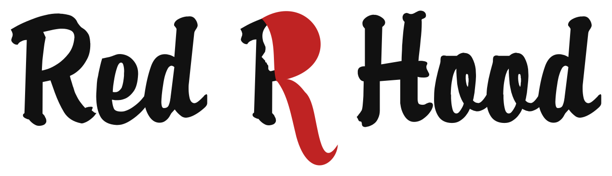
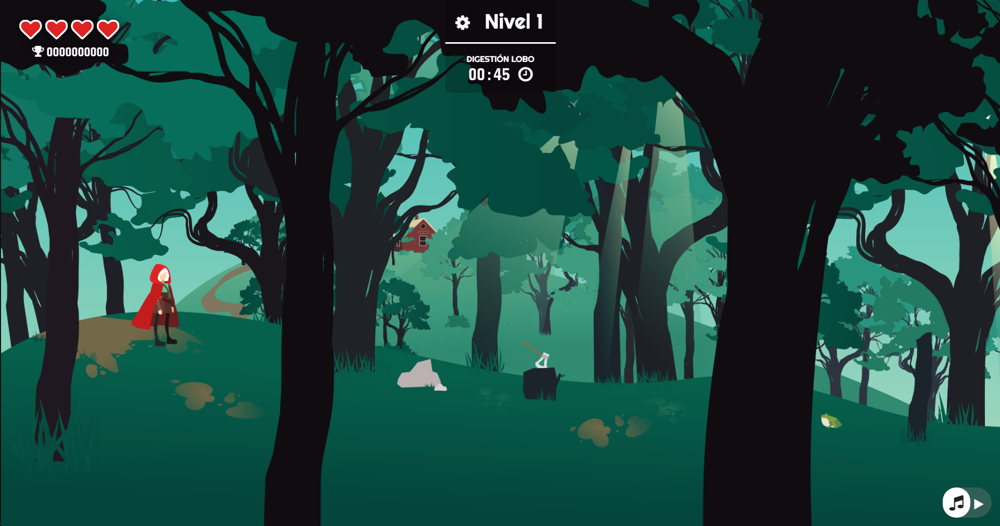
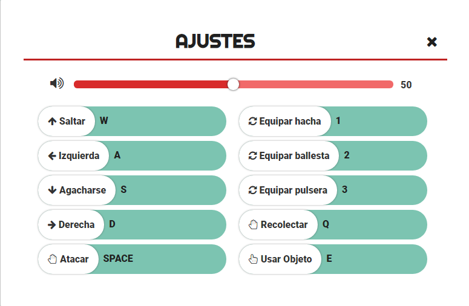

# Red R. Hood
Proyecto de juego de plataformas creado con Jquery y Canvas, basado en el cuento de caperucita roja.

### Juega aquí -> [[Jugar](https://redrhood.netlify.com)]

## Físcas
Todos los personajes terrestres de este juego son afectados por una gravedad que les hace ajustarse al terreno irregular. 

## Colisiones
Todas las colisiones del personaje principal con el resto del mapa se indican en el canvas. Se actualiza en un intervalo para tener la hitbox de los enemigos actualizadas.

## Control
Hay dos tipos de controles
- **Teclado**
* Se controla el movimiento del personaje, pudiendo moverse a los lados, saltar y agacharse.
* Se recoge objetos
* Se ataca
* Se puede cambiar de arma
* Se puede usar objetos como las llaves

- **Ratón**
* Controla la dirección en la que dispara
* Dispara flechas o bolas de fuego.

## Niveles
Se pasa de nivel de diferentes formas:
* **Nivel 1:** Debe conseguir el hacha para cortar el árbol que obstaculiza el camino.
* **Nivel 2:** Debe conseguir la llave que abre el candado.
* **Nivel 3:** Debe tirar de la cuerda para llegar a la rama.

## Enemigos

Hay dos tipos:
* **Terrestres:** Son afectados por la gravedad. Solo se mueven hacia la derecha o izquierda.
* **Voladores:** Ignoran la gravedad y pueden moverse en 4 direcciones dentro de un área limitada.

Ambos tipos aparecen en los puntos marcados como zona enemiga.

## Interfaz
Una sencilla interfaz muestra la vida del personaje, su puntuación, el nivel en el que está y el tiempo que tiene para pasar al siguiente.

Una ventana de ajustes permite controlar el audio y cambiar los controles a gusto del jugador.

I.E.S. Hermanos Machado | Interfaces | Irene Viñas | Febrero 2020
