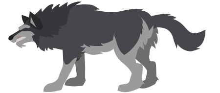

**Red R. Hood** is a platformer game developed with **jQuery** and **Canvas**, inspired by the classic tale of Little Red Riding Hood.

### Play Now -> [[Play Here](https://redrhood.netlify.app)]

## Features

### **Physics**
- All ground-based characters in the game are influenced by gravity, which ensures they adapt realistically to uneven terrain.

### **Collisions**
- The main character's interactions with the environment are precisely tracked on the canvas.
- The hitboxes for enemies are dynamically updated at regular intervals to ensure accurate collision detection.

## Controls
There are two types of controls available:

- **Keyboard**
  - Move the character (left, right, jump, crouch).
  - Pick up objects.
  - Attack.
  - Switch weapons.
  - Use items like keys.

- **Mouse**
  - Aim in the desired direction.
  - Shoot arrows or fireballs.

## Levels
Each level has a unique objective to progress:

- **Level 1:** Obtain the axe to cut down the tree blocking the path.
- **Level 2:** Find the key to unlock the padlock.
- **Level 3:** Pull the rope to reach the branch.

## Enemies

There are two enemy types:

- **Ground-based:**  
  - Affected by gravity.  
  - Move horizontally (left or right).

- **Flying:**  
  - Ignore gravity.  
  - Can move in four directions within a restricted area.

Enemies spawn at designated zones marked as enemy areas.

## Interface
The user interface provides essential information:

- Player's health.
- Current score.
- Active level.
- Remaining time to complete the level.

A settings window allows players to:
- Adjust audio levels.
- Customize controls to suit their preferences.
